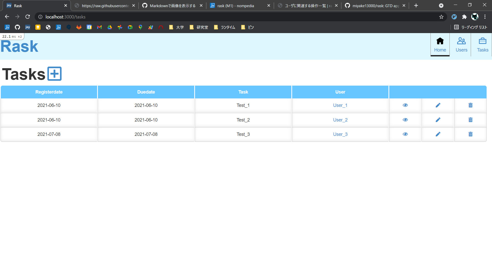
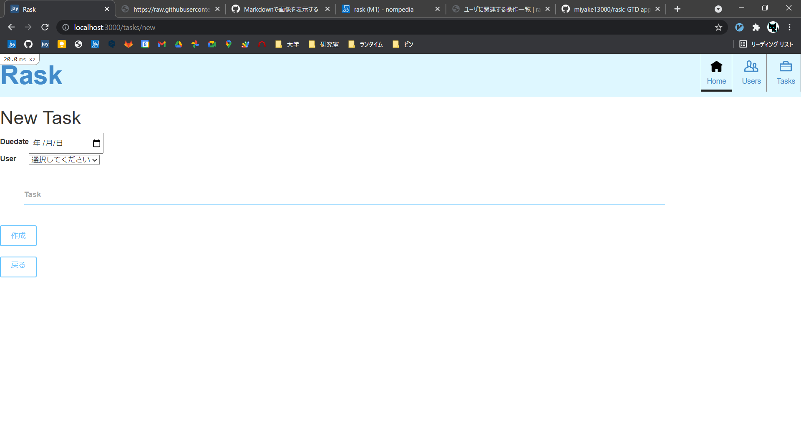
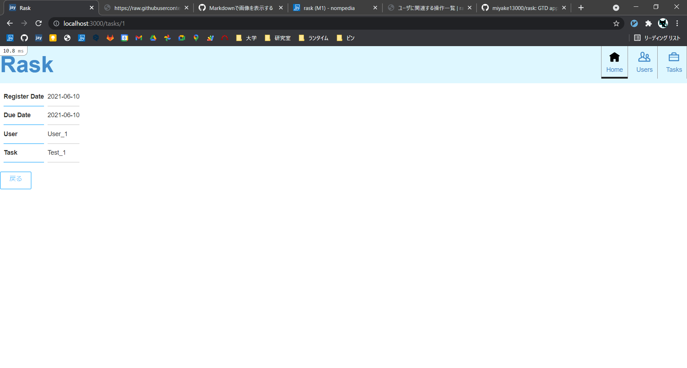
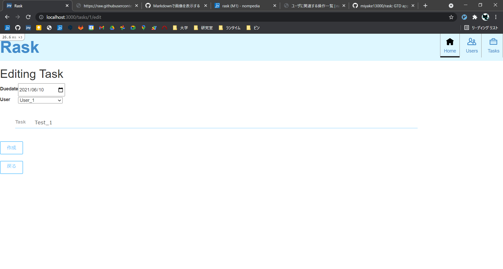

# タスクの操作一覧

## タスクの作成
1. 右上の「Home」または「Tasks」をクリック
2. 画面上部の「+」をクリック
3. 期限(Due Date)，担当ユーザ(User)，タスクの詳細(Task)を入力し，「作成」をクリック

## タスクの表示
1. 右上の「Home」または「Tasks」をクリック
2. タスクの一覧から，内容を確認するタスクの目アイコンをクリック

## タスクの更新
1. 右上の「Home」または「Tasks」をクリック
2. タスクの一覧から，更新するタスクの鉛筆アイコンをクリック
3. 新たなタスクの詳細を入力し，「作成」をクリック

## タスクの削除
1. 右上の「Home」または「Tasks」をクリック
2. タスクの一覧から，削除するタスクのゴミ箱アイコンをクリック
3. 確認ダイアログが出てくるので，OKをクリック

