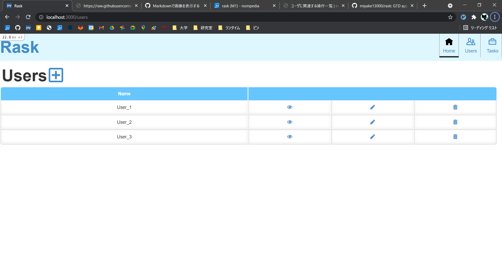
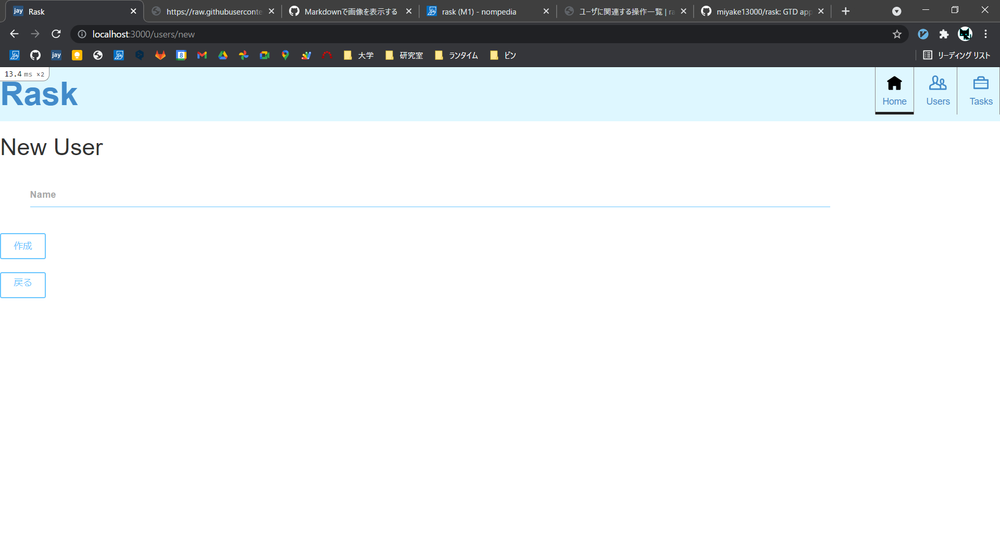
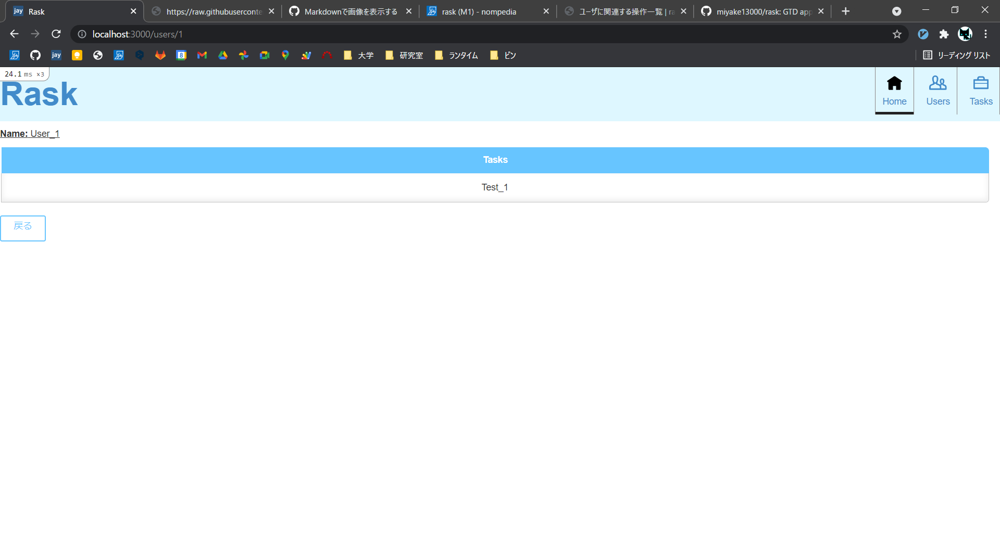

# ユーザに関連する操作一覧

## ユーザの作成
1. 右上の項目から「Users」をクリック
2. 画面上部の「+」をクリック
3. ユーザ名を入力して「作成」をクリック

## ユーザに割り当てられたタスクを表示
1. 右上の項目から「Users」をクリック
2. ユーザ一覧からタスクを表示したいユーザの目アイコンをクリック

## ユーザの更新
1. 右上の項目から「Users」をクリック
2. ユーザ一覧から更新したいユーザの鉛筆アイコンをクリック
3. 新しいユーザ名を入力し，「作成」をクリック

## ユーザの削除
1. 右上の項目から「Users」をクリック
2. ユーザ一覧から削除したいユーザのゴミ箱アイコンをクリック
3. 確認ダイアログが出てくるのでOKを選択
